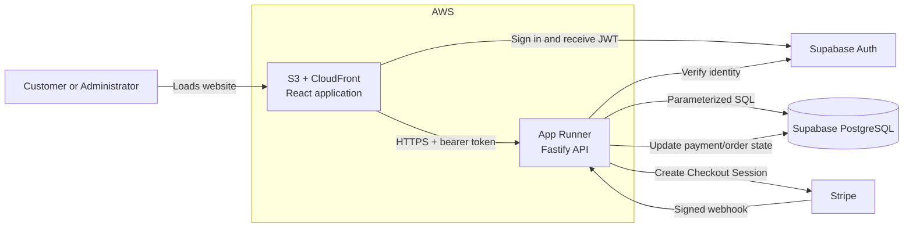

# TinyShop System Context

```mermaid
flowchart LR
    User[Customer or Administrator]

    subgraph AWS
        Web[S3 + CloudFront\nReact application]
        API[App Runner\nFastify API]
    end

    Auth[Supabase Auth]
    DB[(Supabase PostgreSQL)]
    Stripe[Stripe]

    User -->|Loads website| Web
    Web -->|Sign in and receive JWT| Auth
    Web -->|HTTPS + bearer token| API
    API -->|Verify identity| Auth
    API -->|Parameterized SQL| DB
    API -->|Create Checkout Session| Stripe
    Stripe -->|Signed webhook| API
    API -->|Update payment/order state| DB
```
